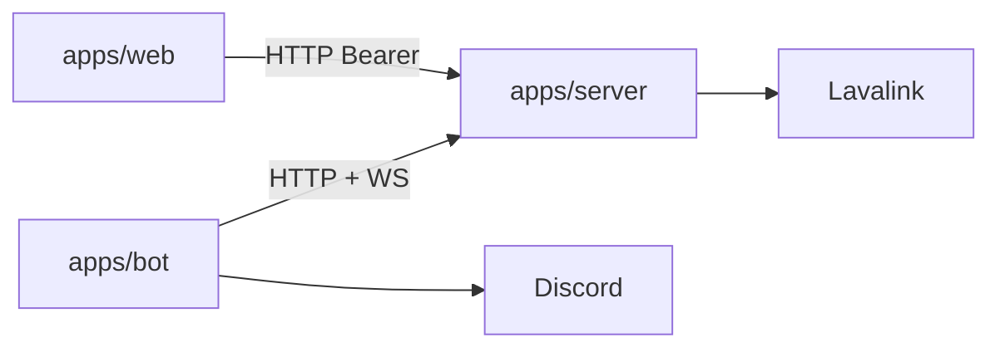

<div align="center">

# Loopify

### A Discord music bot.

[](./LICENSE)
[](https://pnpm.io/)
[](https://nodejs.org/)

<br />

[Repository](https://github.com/unloopedmido/loopify) · [Issues](https://github.com/unloopedmido/loopify/issues)

</div>

---

## The problem

Music bots sit at the intersection of Discord’s gateway, audio pipelines, and whatever UX you expose in chat.

**Loopify** is a **Discord music stack**: a thin **bot** on [discord.js](https://discord.js.org/), a dedicated **music server** that owns [Lavalink](https://lavalink.dev/) and all player/queue state, and an optional **web controller** (Discord OAuth) — scaffolded with [ForgeLoop](https://www.npmjs.com/package/create-forgeloop) on the bot side.



---

## Repository layout

| Path | Role |
| ---- | ---- |
| `apps/bot` | Discord adapter: slash commands, gateway relay of voice packets to the music server |
| `apps/server` | Music brain: `lavalink-client`, queue, REST + `/bot` + `/web` WebSockets |
| `apps/web` | Browser UI: OAuth2, proxies `/api` to `apps/server` with same-VC checks |
| `packages/protocol` | Shared Zod schemas and TypeScript types for cross-service messages |
| `infra/` | Lavalink `application.yml` (used by Docker Compose) |
| `docker-compose.yml` | Lavalink → server → bot + web, health-gated startup |

Root tooling: [Biome](https://biomejs.dev/) for lint/format across the workspace.

<details>
<summary><b>Details</b> — ForgeLoop on the bot</summary>

The bot includes `forgeloop.config.mjs` and is intended to be extended with ForgeLoop CLI workflows (for example adding commands).

Commands sync on startup:

- **Development** uses **guild** sync and requires `GUILD_ID`.
- **Production** uses **global** sync when `NODE_ENV=production`.

Manual deploy from `apps/bot`:

```bash
pnpm forgeloop commands deploy --guild
# or
pnpm forgeloop commands deploy --global
```

</details>

---

## Getting started

**Requirements:** [Docker](https://docs.docker.com/get-docker/) with Compose v2.

1. Clone and copy the env file:

```bash
git clone https://github.com/unloopedmido/loopify.git
cd loopify
cp .env.example .env
```

2. Fill in the secrets in `.env` (Discord token, OAuth credentials, internal token, Lavalink password).

3. Start the whole stack:

```bash
docker compose up --build
```

Compose starts the services in order — **Lavalink** first, then **server**, then **bot** and **web** in parallel. The web UI is published on http://localhost:8080.

Stop with Ctrl+C, or `docker compose down` to remove containers.

### Docker development

For live reload inside Docker, use the dev override:

```bash
pnpm run docker:dev
```

This keeps `docker-compose.yml` production-like and adds a dev-only watcher stack:

- `packages/protocol` rebuilds in watch mode
- `apps/server` and `apps/bot` restart on edits via `tsx --watch`
- `apps/web/server` restarts on edits on port `8080`
- the Vite client runs with HMR on `http://localhost:5173`

Set `GUILD_ID` in `.env` before using this flow so the bot can sync commands in development mode.

### Required environment variables

| Variable | Purpose |
| -------- | ------- |
| `LAVALINK_SERVER_PASSWORD` | Lavalink password (also injected into `infra/application.yml`) |
| `INTERNAL_API_TOKEN` | Bearer token shared between `server`, `bot`, and `web` |
| `DISCORD_TOKEN` | Bot token |
| `CLIENT_ID` | Discord application ID |
| `GUILD_ID` | Optional — sync slash commands to a single guild (instant). Leave blank for global. |
| `PUBLIC_BASE_URL` | Public URL of the web app (e.g. `http://localhost:8080`) |
| `DISCORD_CLIENT_ID` / `DISCORD_CLIENT_SECRET` / `DISCORD_OAUTH_REDIRECT_URI` | Web OAuth2 |
| `WEB_SESSION_SECRET` | Long random string used to sign session cookies |

---

## Contributing

Issues and PRs are welcome on [GitHub](https://github.com/unloopedmido/loopify). Run `pnpm run check` before submitting substantive changes.

## License

MIT — see [`LICENSE`](./LICENSE).
